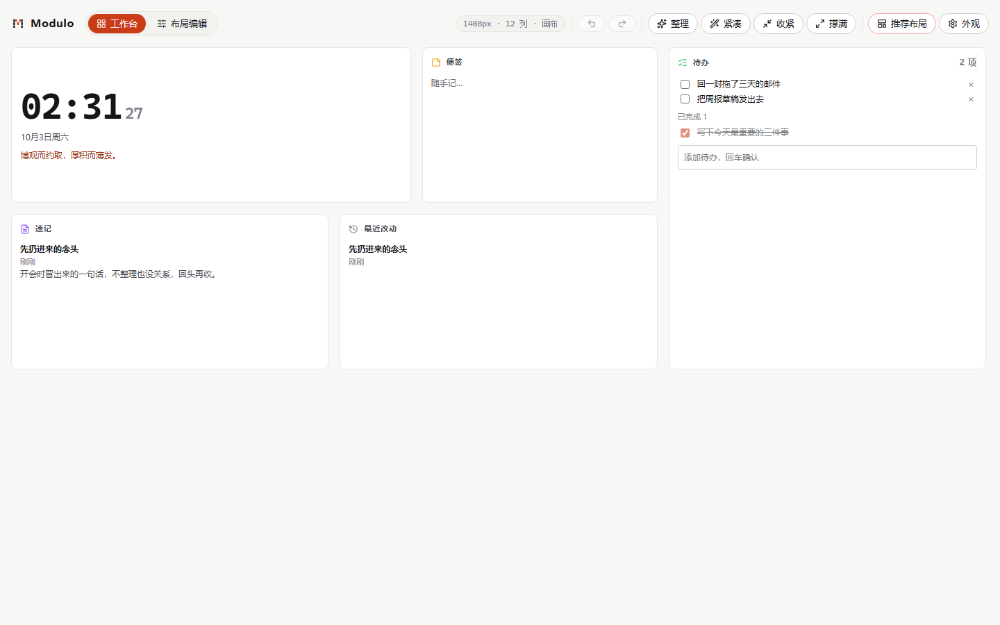
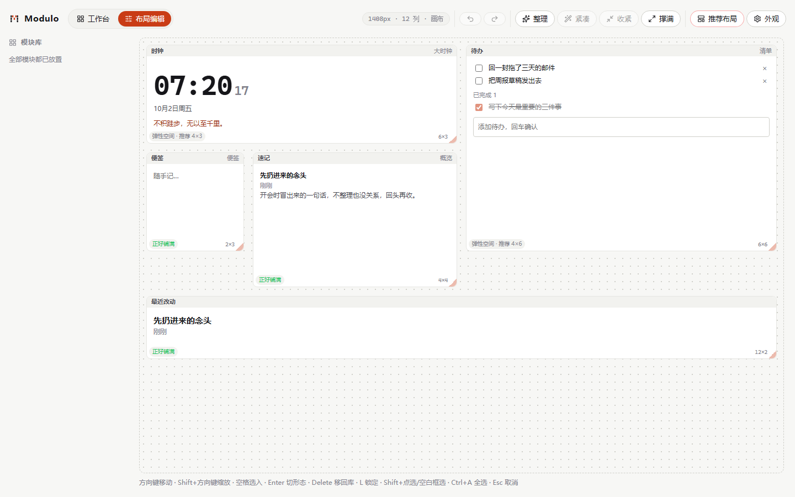

# Modulo

自适应的自由编排工作台。**一份布局，从 1920 桌面到 390 窄屏都能编排、都能读、都能用键盘操作。**

[](https://github.com/Levango7/Modulo/actions/workflows/ci.yml)

**先试 30 秒（不用装任何东西）**：[网页版](https://levango7.github.io/Modulo/)。打开后**把窗口从宽拖到窄** —— 这就是这个产品的全部：12 列逻辑版面会按容器宽度投影成 12 / 8 / 6 / 4 / 1 列，卡片按形态降档而不是被压成碎片。数据存在浏览器 localStorage 里，与桌面版各存各的。

**想要装起来用**：[Releases · v0.4.0](https://github.com/Levango7/Modulo/releases/tag/v0.4.0) 里有 Windows x64 的 NSIS 安装包（`Modulo_0.4.0_x64-setup.exe`，2 806 839 字节，`sha256 53c431d5f7971bc8b17265042c1f6e33d35eaac10cff3542df3eaa1bf627ac18`，构建自 `b27142e`，该二进制在本机通过全部 49 项真机检查）。**装过这一版之后，以后的新版本可以在设置页里直接更新**（下载 → 本地验签 → 重启安装）。安装包**没有代码签名**，首次运行 Windows SmartScreen 会提示「未知发布者」。数据落在 `%APPDATA%\app.modulo\data\*.json`，整个目录拷走就是备份。



## 界面




还有「备份」：设置页里「导出备份（含内容）」把**版面、方案册和卡片内容**（便签 / 待办 / 速记的正文）打进一个 JSON，换机器或重装靠它。恢复时会先把这份包里有什么摆出来让你确认 —— 覆盖是破坏性的，就不省这一步。

## 跑起来

```bash
npm ci
npm run dev            # 浏览器预览 http://localhost:1430
npm run verify         # 类型检查 + 单测（含引擎覆盖率门禁）+ 构建 + 真浏览器 E2E
npm run tauri:dev      # 桌面窗口（需 Rust 工具链，见下）
npm run desktop:probe  # 桌面壳真机自检：自己起窗口、走完 49 项检查再关掉
```

Windows 上若用 **MSYS2 的 GNU 工具链**（本机情况：`rustc` host 为 `x86_64-pc-windows-gnu`，`gcc`/`windres` 在 MSYS2 里而不在 PATH），构建前需要把它注入到该次命令的 PATH：

```bash
export PATH="/d/msys64/mingw64/bin:$PATH"
npm run tauri:build -- --no-bundle   # 只出 exe；去掉 --no-bundle 会去下载 NSIS 打安装包
```

`tauri-build` 在 GNU 目标上要 `windres` 打资源，缺它会报找不到资源编译器 —— 这是环境 PATH 问题，不是代码问题。

## 它跟同类产品的差别

| 能力 | 做法 |
|---|---|
| 真响应式 | 逻辑 12 列恒定，物理列数按容器宽度**投影**（12/8/6/4/1），投影只读、不回写你的布局 |
| 调不坏 | 尺寸约束挂在"形态"的 `minW/minH` 上，缩放低于最小值会被拒绝而不是把内容压碎 |
| 键盘可达 | 方向键移动、`Shift+方向键`缩放、多选时 `Alt+方向`只动当前格、空格选入、`Enter`循环切形态、`Delete`/`Backspace`移回库、`L`锁定、`Ctrl/Cmd+A`全选、`Esc`取消、`Ctrl+Z` 撤销 / `Ctrl+Shift+Z`·`Ctrl+Y` 重做 |
| 可回退 | 50 步历史栈，一次拖拽 = 一步；组合动作（紧凑）保留分步撤销 |
| 版面工具 | 整理（聚拢空洞）、撑满（按行铺满）、收紧（按内容实测降高）、紧凑（收紧+整理，仍可分步撤销） |
| 版面模板 | 出厂默认 + 8 张推荐排法（通用 / 大字时钟 / 极简专注 / 会议记录 / 开发排障 / 写作收集 / 备考清单 / 效率仪表盘），首启自动弹一次，**卡片上画着真实格子**；换错 Ctrl+Z 退回；自己排的存进方案册 |
| 添加卡片 | 工具条「添加卡片」把还没在版面上的卡加进来：**24 种卡**按分组排列（时间 / 记录 / 工具 / 联网 / 专注），出厂版面只放 5 张，一项一句说明；一步 Ctrl+Z 退回。通往 40 张的目录见 `docs/CARD-CATALOG.md` |
| 联网卡片 | 天气（open-meteo）、空气质量（**城市跟着天气卡走**）、汇率（牌价 + 换算，免 key）、GitHub 仓库动态（星级 / issue / 最后推送）、HN 热榜 —— 全部**首次渲染才查、缓存、取不到保留上一份并如实说**，一次启动不给任何服务器发请求 |
| 时间与日期 | 月历（当月格子、今天高亮、可翻月）、时间进度（今天 / 本月 / 今年 + 还剩多少）、世界时钟（最多 4 城，时间与时差）、倒数日（离那个日子还有几天）、正计时（"第 N 天"）、日期工具（星期几 / 相差几天 / 加减天数）—— 全部本地计算，不联网 |
| 工具类卡片 | 计算器（表达式解析，**无 eval**）、单位换算（长度 / 重量 / 温度 / 面积 / 速度 / 数据量）、颜色工具（HEX / RGB / HSL + 对比度建议）、文本统计（字素簇口径）、随机数（RNG 注入）、进制转换（BigInt，大数不丢精度）、习惯打卡（一周格子 + 连续天数，今天没打卡不归零） |
| 天气卡 | 唯一一张接外部数据的卡（open-meteo，不用账号）：当前温度 / 天气 / 今天高低温 / 日出日落 + 明天起三天；卡片上永远写着"多久之前更新"，取不到就保留上一份并明说 |
| 多版面 | 命名方案册（可新建空白、拖拽或 `Alt+↑/↓` 排序）+ 布局/方案两套 JSON 导入导出，导入前逐条校验 |
| 三套外观 | 墨纸 / 柔光 / 亮彩，纯令牌层切换，含模块身份色与强调色 |
| 桌面壳 | 无边框自制标题栏、托盘、系统级快捷键（设置页可录制改键，注册失败会显示原因）；启动尺寸按显示器工作区逐轴夹取（默认 1280×800 逻辑档）；能力清单刻意不含 `allow-create` / `allow-destroy`，运行期不建窗 |

## 结构

```
packages/engine/  **@modulo/engine**：纯函数引擎（几何、碰撞、落位、形态、投影、历史、校验、方案册、模板 + 各卡的纯逻辑：天气、月历、进度、世界时钟、倒数日、计算器、单位换算、日期工具、颜色、文本统计、随机数、进制、习惯、汇率、空气质量、仓库、HN、月相）
                ★ 不引用框架与 DOM，由 tests/engine-purity.test.ts 与它自己的构建（lib 只有 ES2022、无 DOM）双重执法
src/vue/        适配层：store、指针拖拽、键盘、FLIP、皮肤、持久化
src/app/cards/  卡片：全部用容器查询连续缩放
tests/          单测 + fast-check 属性测试（投影不变量）+ 真浏览器 E2E
docs/ARCHITECTURE.md   设计定稿与决策记录（含被测试逼出来的修正）
CHANGELOG.md           迭代变更历史（新增 / 修复 / 门禁 / 已知问题）
```

## 验证

CI（`.github/workflows/ci.yml`）两个 job：`verify` 跑五步 —— 类型检查 → 单测与属性测试（**顺带卡受测层分支覆盖 ≥90%**，`npm run cover:engine`）→ 构建 → E2E → 文档数字核对；`desktop` 在 windows-latest 上跑 `cargo fmt --check` → `clippy -D warnings` → `cargo test` → 真打包出 exe 并上传产物。**桌面自检探针（`npm run desktop:probe`，49 项）不在 CI 跑** —— 试过，摘了：runner 上 WebView2 不把远调端口参数写进浏览器进程，探针每次都停在"连 CDP"那一步，与产品好坏无关。它的定位是**发布前的本机门禁**，跑在要发出去的那颗二进制上（见 `docs/ARCHITECTURE.md` §10.3 / §11.4）。
投影算法有**五条**断言（只读、幂等、无重叠、尺寸充分、分区完整），用随机版面 × 7 档列数各 200 例做属性测试。
两条量化门禁：受测层（`packages/engine/src/**` 全量 + 7 个 vue 纯模块）分支覆盖 ≥90%（`npm run cover:engine`，当前 **≥94%** —— engine 94.81%、vue 纯模块 96.14%）、真拖期间帧距中位数 ≤18.2ms（E2E 里用 rAF 采样，本机 headless 实测 16.7ms —— headless 只能当下限看）。<!-- facts -->
还有第三条 `npm run docs:check`：实跑一遍单测与构建，核对本文与架构文档里**认领了规模数字**的那几行 —— 文档里的"单测条数"是人抄的，抄错没人会发现，现在机器会拦。它只认显式标记过的行，所以这段说明、§3.5 的历史实验数字都不会被误判成漂移。
桌面壳另有一条 `npm run desktop:probe`：给 WebView2 开远调端口，用 CDP 点真实的 DOM 按钮、派发真的 mousedown，再从 Win32 侧读窗口状态（图标态/工作区/样式位），不模拟鼠标所以不会抢走指针；召唤键用 SendKeys 从系统输入队列投递，正例（收起→唤出）之外还有反例（投一个不该生效的组合键，断言窗口纹丝不动），改键链路也在真窗口里跑一遍。窗口状态一律轮询等到落地再断言——单次 Win32 采样实测 1.1–1.3 秒，固定 sleep 会把「慢」误报成「坏」。截图落在 `evidence/desktop/`。

## 许可

Apache-2.0，全文见 [LICENSE](LICENSE)。选它而不是 MIT 的原因：带显式专利授权与商标条款。同目录的 NexusChain 与 OpsMesh 也都是 Apache-2.0（但并非全部 —— corps 与 Interaction 是 MIT，所以"跟邻居一致"只对这几个仓库成立）。
